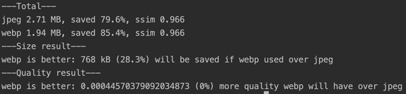

## webp-jpeg-comparison

[🇬🇧 Read in english](https://github.com/shrpne/webp-jpeg-comparsion/blob/master/README.md)

В этом репозитории я пытаюсь определить, действительно ли стоит конвертировать изображения в [webp](https://developers.google.com/speed/webp/) и заморачиваться с `<picture>` вместо того, чтобы просто использовать минифицированный jpeg.

Для минификации jpeg я сначала использую сжатие с потерями с [mozjpeg](https://github.com/mozilla/mozjpeg), ~~а затем поверх сжатие без потерь через [jpegtran](https://github.com/imagemin/imagemin-jpegtran). В 70% случаев jpegtran ничем не помогает, но в остальных 30% он дополнительно сжимает на 10-40%. Странно, но как бы то ни было, оно работает.~~ Похоже, что mozjpeg работает нормально без jpegtran, начиная с версии 3.2

Я сравниваю разницу в размере между оптимизированый и оригинальным набором изображений, а так же сравниваю потерю в качестве с помощью [SSIM](https://github.com/darosh/image-ssim-js)


### Использование

Клонировать репозиторий, затем запустить:
```
npm i
npm start
```

Вы можете использовать собственный набор изображений, сложив их в `./src`

Я предлагаю опытным путем найти нужные настройки `quality` для плагинов `imagemin-webp` и `imagemin-mozjpeg`, при которых среднее SSIM будет одинаковым у пожатых webp и jpeg. И затем смотреть какой из методов оптимизации дал лучший результат по сжатому размеру.


### Результат


Чтобы получить одинаковый SSIM для набора изображений из этого репозитория нужно установить следующие настройки `quality`: webp - 80, mozjpeg - 84. С такими настройками webp даст лучший результат, сжав на 28% лучше, по сравнению с mozjpeg. 

Для разных наборов изображений, которые я тестировал с одинаковым SSIM, webp всегда давал лучший результат, выигрывая в размере на 20-30%.

В итоге, действительно стоит готовить отдельную webp версию изображений, т.к. 25% это довольно существенная разница.


### Заметки

Стоит иметь в виду, что webp и mozjpeg дают разный вид артефактов при компрессии. 

Webp сглаживает шумы и изображения могут получится более мыльными, но для вектор-подобной графики, с ровными краями и большими областями однотонного цвета webp наоборот даст более четкие края. 

Mozjpeg при сжатии зашумляет изображение. У mozjpeg результат получается более предсказуемый в зависимости от настроек качества, в то время как webp иногда жмет слишком сильно и с большим количеством артефактов на достаточно высоких настройках качества. Так же mozjpeg устойчив к многочисленным пережатиям, но все равно лучше этим не злоупотреблять и использовать в качестве исходника высококачественные jpg или png файлы для всех алгоритмов компрессии.
 
